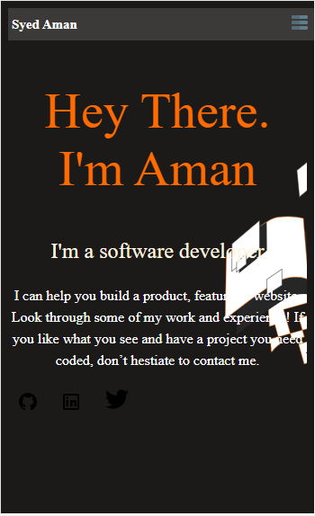

# Project Name

> One paragraph statement about the project.

Additional description about the project and its features.

## Built With

- HMTL
- CSS

## Live Demo

[Live Demo Link](https://livedemo.com)

## Getting Started

**This is an example of how you may give instructions on setting up your project locally.**
**Modify this file to match your project, remove sections that don't apply. For example: delete the testing section if the currect project doesn't require testing.**

To get a local copy up and running follow these simple example steps.

### Prerequisites

### Setup

### Install

### Usage

### Run tests

### Deployment

## Authors

👤 **Author1**

- GitHub: [@githubhandle](https://github.com/SyedAman10)
- Twitter: [@twitterhandle](https://twitter.com/SyedAman9248)
- LinkedIn: [LinkedIn](https://www.linkedin.com/in/syed-aman-ullah-238500196/)

## 📝 License

This project is [MIT](./MIT.md) licensed.
